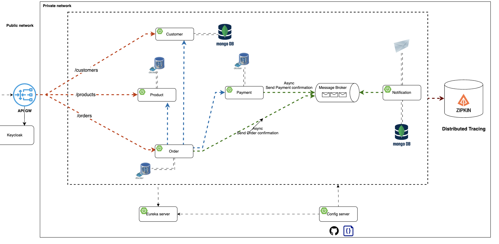

# E-Commerce Microservices Application

A modern, scalable e-commerce platform built with microservices architecture using Spring Boot and Spring Cloud. This application demonstrates best practices for building distributed systems with service discovery, API gateway, configuration management, and event-driven communication.

## 🏗️ Architecture

This application follows a microservices architecture pattern with the following components:

- **API Gateway**: Single entry point for all client requests with OAuth2 authentication
- **Service Discovery**: Eureka-based service registry for dynamic service discovery
- **Config Server**: Centralized configuration management
- **Identity & Access Management**: Keycloak for authentication and authorization
- **Business Services**: Customer, Product, Order, Payment, and Notification services
- **Message Broker**: Kafka for asynchronous event-driven communication
- **Distributed Tracing**: Zipkin for request tracing across services

### Architecture Diagram



The diagram above illustrates the complete system architecture, showing:

- **Public Network**: API Gateway and Keycloak handling external requests and authentication
- **Private Network**: Core microservices (Customer, Product, Order, Payment, Notification) with their respective databases
- **Service Communication**: 
  - Synchronous REST calls between services (e.g., Order → Customer, Order → Product, Order → Payment)
  - Asynchronous messaging via Kafka Message Broker for order and payment confirmations
- **Infrastructure Services**: Eureka for service discovery, Config Server for centralized configuration, and Zipkin for distributed tracing
- **Data Storage**: MongoDB for Customer and Notification services, PostgreSQL for Product, Order, and Payment services

## 🚀 Technology Stack

### Core Technologies
- **Java 17**
- **Spring Boot 4.0.1** / **3.2.12**
- **Spring Cloud 2025.1.0** / **2023.0.5**
- **Maven** - Dependency management and build tool

### Spring Cloud Components
- **Spring Cloud Gateway** - API Gateway and routing
- **Spring Cloud Config** - Centralized configuration server
- **Netflix Eureka** - Service discovery and registration
- **Spring Cloud OpenFeign** - Declarative REST client for inter-service communication

### Databases
- **PostgreSQL** - Relational database for Product, Order, and Payment services
- **MongoDB** - NoSQL database for Customer service
- **Flyway** - Database migration tool

### Messaging & Communication
- **Apache Kafka** - Event streaming platform for asynchronous communication
- **Zookeeper** - Coordination service for Kafka

### Security & Authentication
- **Keycloak** - Identity and Access Management (IAM) server
- **Spring Security OAuth2 Resource Server** - JWT-based authentication
- **JWT (JSON Web Tokens)** - Token-based authentication

### Observability & Monitoring
- **Zipkin** - Distributed tracing system
- **Spring Boot Actuator** - Application monitoring and metrics
- **Micrometer** - Metrics collection

### Development Tools
- **Lombok** - Reduces boilerplate code
- **MailDev** - Email testing tool for development
- **PgAdmin** - PostgreSQL administration tool
- **Mongo Express** - MongoDB web interface

## ✨ Features

- **Customer Management**: Create, update, retrieve, and delete customer information
- **Product Catalog**: Manage products with categories, inventory, and pricing
- **Order Processing**: Create and manage orders with order lines
- **Payment Processing**: Handle payment transactions
- **Email Notifications**: Send order and payment confirmation emails via Kafka
- **Service Discovery**: Automatic service registration and discovery
- **API Gateway**: Unified API endpoint with routing and load balancing
- **Authentication & Authorization**: OAuth2/JWT-based security with Keycloak
- **Distributed Tracing**: Track requests across multiple services
- **Configuration Management**: Centralized configuration with Spring Cloud Config

## 📁 Project Structure

```
e-commerce-app/
├── services/
│   ├── config-server/          # Spring Cloud Config Server
│   ├── discovery/               # Eureka Service Discovery
│   ├── gateway/                 # API Gateway Service
│   ├── customer/                # Customer Management Service (MongoDB)
│   ├── product/                 # Product Catalog Service (PostgreSQL)
│   ├── order/                   # Order Management Service (PostgreSQL)
│   ├── payment/                 # Payment Processing Service
│   └── notification/            # Email Notification Service (Kafka)
├── docker-compose.yml           # Docker services configuration
└── diagrams/                    # Architecture diagrams
```

## 📋 Prerequisites

Before running this application, ensure you have the following installed:

- **Java 17** or higher
- **Maven 3.6+**
- **Docker** and **Docker Compose** (for infrastructure services)
- **Git**

## 🛠️ Getting Started

### 1. Clone the Repository

```bash
git clone <repository-url>
cd e-commerce-app
```

### 2. Start Infrastructure Services

Start all required infrastructure services using Docker Compose:

```bash
docker-compose up -d
```

This will start the following services:
- PostgreSQL (port 5432)
- PgAdmin (port 5050)
- MongoDB (port 27017)
- Mongo Express (port 8081)
- Zookeeper (port 22181)
- Kafka (port 29092)
- MailDev (ports 1080, 1025)
- Zipkin (port 9411)
- **Keycloak** (port 9080)

### 3. Build the Project

Build all microservices:

```bash
# Build all services
mvn clean install -DskipTests
```

Or build individual services:

```bash
cd services/config-server
mvn clean install
```

### 4. Run Services in Order

Start the services in the following order:

#### Step 1: Start Config Server
```bash
cd services/config-server
mvn spring-boot:run
```
Config Server runs on port **8888**

#### Step 2: Start Discovery Service
```bash
cd services/discovery
mvn spring-boot:run
```
Discovery Service runs on port **8761**

#### Step 3: Start Business Services
Open separate terminal windows and start each service:

```bash
# Customer Service
cd services/customer
mvn spring-boot:run

# Product Service
cd services/product
mvn spring-boot:run

# Order Service
cd services/order
mvn spring-boot:run

# Payment Service
cd services/payment
mvn spring-boot:run

# Notification Service
cd services/notification
mvn spring-boot:run
```

#### Step 4: Start API Gateway
```bash
cd services/gateway
mvn spring-boot:run
```
Gateway Service runs on port **8222**

### 5. Configure Keycloak

After Keycloak starts, access the admin console and set up the realm:

1. **Access Keycloak Admin Console**: http://localhost:9080
2. **Login**: 
   - Username: `admin`
   - Password: `admin`
3. **Create a Realm**: 
   - Click "Create Realm" or select from the realm dropdown
   - Name: `microservice` (must match the realm name in gateway configuration)
4. **Create a Client**:
   - Go to Clients → Create
   - Client ID: `ecommerce-client` (or your preferred name)
   - Client Protocol: `openid-connect`
   - Access Type: `public` or `confidential` based on your needs
   - Valid Redirect URIs: `http://localhost:8222/*`
   - Web Origins: `http://localhost:8222`
5. **Create Users** (optional):
   - Go to Users → Add user
   - Set username and credentials

### 6. Verify Services

- **Eureka Dashboard**: http://localhost:8761
- **API Gateway**: http://localhost:8222
- **Keycloak Admin Console**: http://localhost:9080
- **Zipkin**: http://localhost:9411
- **PgAdmin**: http://localhost:5050
- **Mongo Express**: http://localhost:8081
- **MailDev**: http://localhost:1080

## 🔐 Authentication & Authorization

The API Gateway is secured with OAuth2/JWT authentication using Keycloak. All API endpoints (except `/eureka/**`) require a valid JWT token.

### Getting an Access Token

#### Using Keycloak Admin Console:
1. Access Keycloak: http://localhost:9080
2. Navigate to your realm → Clients → Select your client
3. Go to the "Credentials" tab to get the client secret (if using confidential client)
4. Use the token endpoint to get an access token

#### Using cURL:
```bash
# Get access token (replace with your actual client credentials)
curl -X POST http://localhost:9080/realms/microservice/protocol/openid-connect/token \
  -H "Content-Type: application/x-www-form-urlencoded" \
  -d "client_id=ecommerce-client" \
  -d "username=your-username" \
  -d "password=your-password" \
  -d "grant_type=password"
```

#### Using Postman or Similar Tools:
1. Set request type to POST
2. URL: `http://localhost:9080/realms/microservice/protocol/openid-connect/token`
3. Body (x-www-form-urlencoded):
   - `grant_type`: `password`
   - `client_id`: `ecommerce-client`
   - `username`: `your-username`
   - `password`: `your-password`

### Making Authenticated Requests

Include the access token in the Authorization header:

```bash
curl -X GET http://localhost:8222/api/v1/products \
  -H "Authorization: Bearer YOUR_ACCESS_TOKEN"
```

## 🔌 API Endpoints

All API requests should be made through the API Gateway at `http://localhost:8222`.

**Note**: All endpoints require authentication via JWT token (except `/eureka/**`).

### Customer Service
- `POST /api/v1/customers` - Create a new customer
- `GET /api/v1/customers` - Get all customers
- `GET /api/v1/customers/{customer-id}` - Get customer by ID
- `PUT /api/v1/customers` - Update customer
- `DELETE /api/v1/customers/{customer-id}` - Delete customer
- `GET /api/v1/customers/exists/{customer-id}` - Check if customer exists

### Product Service
- `POST /api/v1/products` - Create a new product
- `GET /api/v1/products` - Get all products
- `GET /api/v1/products/{product-id}` - Get product by ID
- `POST /api/v1/products/purchase` - Purchase products (inventory management)

### Order Service
- `POST /api/v1/orders` - Create a new order
- `GET /api/v1/orders` - Get all orders
- `GET /api/v1/orders/{order-id}` - Get order by ID

### Payment Service
- `POST /api/v1/payments` - Process a payment

## 🗄️ Database Configuration

### PostgreSQL
- **Host**: localhost
- **Port**: 5432
- **Username**: sonny
- **Password**: sonny
- **Database**: Created automatically by services

### MongoDB
- **Host**: localhost
- **Port**: 27017
- **Username**: sonny
- **Password**: sonny

## ⚙️ Configuration

The application uses Spring Cloud Config Server for centralized configuration. Configuration files are located in:
```
services/config-server/src/main/resources/configurations/
```

Each service has its own configuration file:
- `customer-service.yml`
- `product-service.yml`
- `order-service.yml`
- `payment-service.yml`
- `gateway-service.yml`
- `notification-service.yml`
- `discovery-service.yml`

### Keycloak Configuration

The Gateway service is configured to use Keycloak as the OAuth2 resource server:

```yaml
spring:
  security:
    oauth2:
      resourceserver:
        jwt:
          issuer-uri: "http://localhost:9080/realms/microservice"
```

**Important**: The realm name in Keycloak must match the realm name in the configuration (`microservice`).

## 🔄 Service Communication

- **Synchronous**: Services communicate using **OpenFeign** for REST API calls
- **Asynchronous**: Services use **Kafka** for event-driven communication
  - Order service publishes order confirmation events
  - Notification service consumes events and sends emails

## 🧪 Testing

Run tests for all services:

```bash
mvn test
```

Run tests for a specific service:

```bash
cd services/customer
mvn test
```

## 📊 Monitoring & Observability

- **Zipkin**: Distributed tracing - http://localhost:9411
- **Eureka Dashboard**: Service registry - http://localhost:8761
- **Actuator Endpoints**: Health checks and metrics available at `/actuator` on each service

## 🐳 Docker Services

The `docker-compose.yml` file includes all infrastructure services needed for the application:

- **PostgreSQL**: Primary relational database
- **MongoDB**: Document database for customer service
- **Kafka & Zookeeper**: Message broker for event streaming
- **Keycloak**: Identity and Access Management server
- **MailDev**: Email testing tool
- **Zipkin**: Distributed tracing
- **PgAdmin & Mongo Express**: Database administration tools

## 🔐 Default Credentials

### Keycloak
- **Admin Console**: http://localhost:9080
- **Admin Username**: `admin`
- **Admin Password**: `admin`
- **Realm**: `microservice` (must be created manually)

### PostgreSQL (PgAdmin)
- Email: `pgadmin4@pgadmin.org`
- Password: `admin`

### MongoDB
- Username: `sonny`
- Password: `sonny`

## 🚧 Development Notes

- Services are configured to use Spring Cloud Config Server for centralized configuration
- All services register with Eureka for service discovery
- The API Gateway routes requests to appropriate services using service names
- **All API endpoints are secured with OAuth2/JWT authentication via Keycloak**
- The Gateway validates JWT tokens against Keycloak's issuer URI
- Database migrations are handled by Flyway
- Email notifications are sent asynchronously via Kafka
- Keycloak realm must be created and configured before making authenticated API calls

## 📝 License

This project is for educational purposes.

## 👤 Author

**Sonny**

---

## 🤝 Contributing

Contributions, issues, and feature requests are welcome!

## 📞 Support

For support, please open an issue in the repository.

